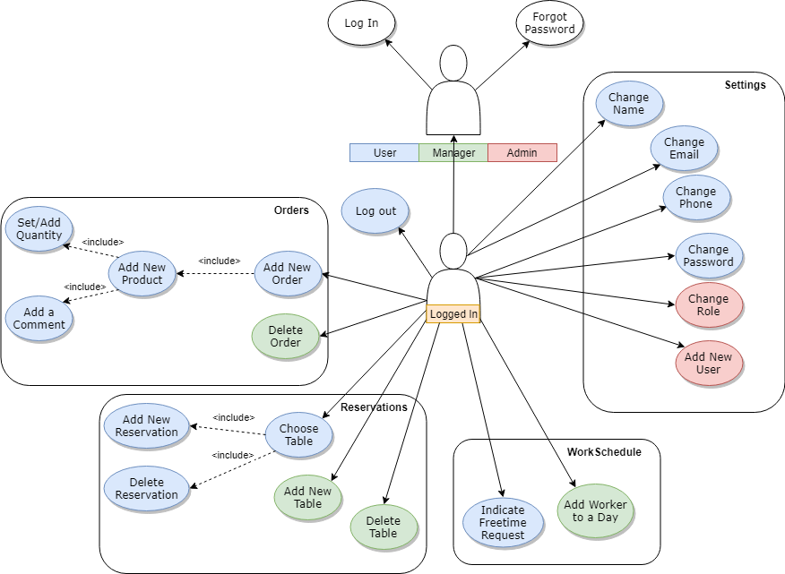
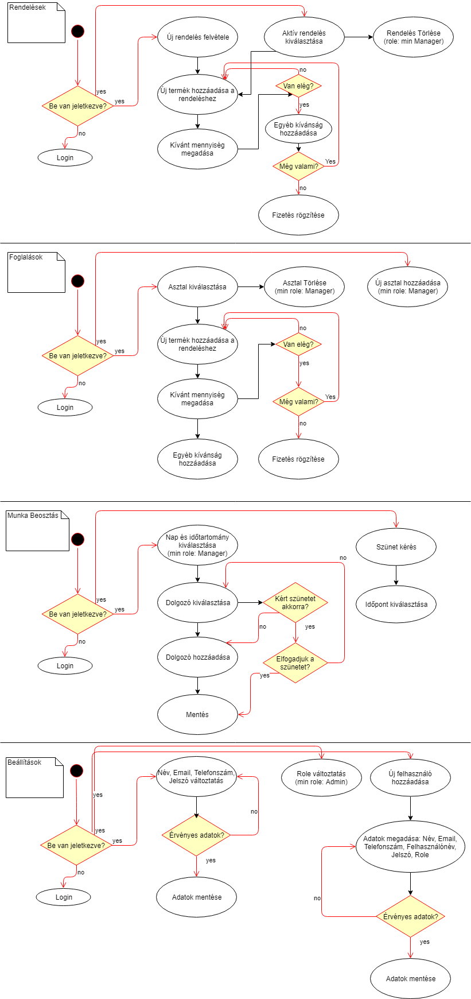
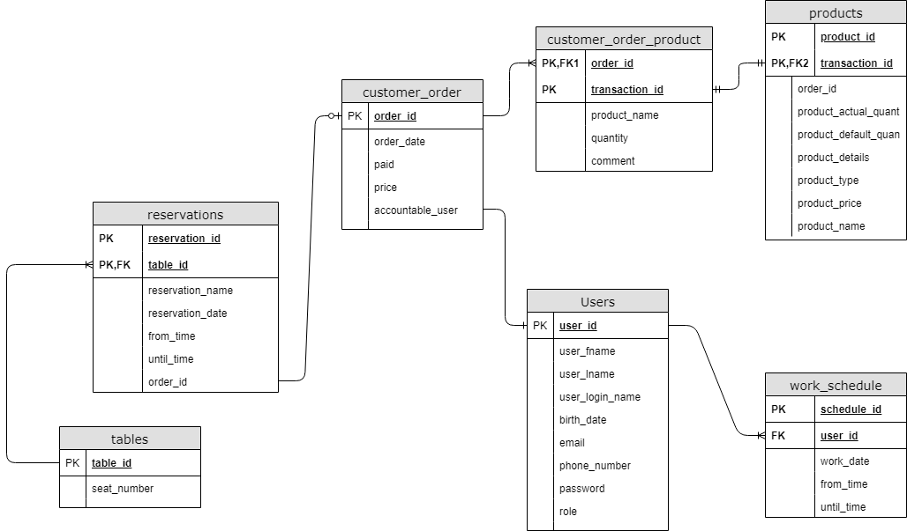

# pubManager

*Készítette Madácsi Dávid - LJJQW0 2018*

## Követelmény feltárás

### Célkitűzés

A program célja, hogy egy bár működését segítse. Főbb feladatai közé tartozik a rendelések felvétele, nyomon követése, a dolgozók munkaidejének beosztása és a foglalások kezelése.

### Funkcionális követelmények: 

A program indításakor egy beléptető rendszerrel találkozunk, ahol egy felhasználó és jelszó segítségével bejelentkezhetünk az applikációba. Minden felhasználónak megvan a jogköre, így megkülönböztetünk Admin, Menedzsert és Pultost. Belépés után több menüpontból választhat a felhasználó: 
* Orders: Ezen a fülön találhatóak a rendelések időrendben. Itt egy id, egy név és egy időpont tartozik minden rendeléshez, majd kijelölve láthatóak az addig megrendelt italok, ételek, árral és összesített árral feltünteve. Ebben a szekcióban lehetőségünk van hozzáadni plusz ételt, italt, valamint jelezni, hogy a fizetés megtörtént. Törlésre a Menedzsernek és az Adminnak van csak joga. 
* Reservations: Itt az addig beérkezett foglalásokat találjuk, id-val, névvel, asztallal, időponttal ellátva. Lehetőségünk van új foglalás felvételére, törlésére, módosítására, aszerint, hogy van-e a kívánt időpontra szabad asztal. 
* Work Schedule: Ez a felület a Pultosok számára csak olvasható formában jelenik meg, de jelezhetik jövőbeli ráérésük állapotát. Az Admin és a Manager beoszthatja az alkalmazottakat. 
* Settings: Itt van lehetőség jogkör módosításra (csak Admin), felhasználónév - jelszó módosításra, hibabejelentésre.

### Használati eset diagram:	

### Állapot diagram:

### Adatbázis terv:

### Letöltés és Indítás:
* Clone project:
	* Terminálból: $ git clone https://github.com/madave91/pubManager_HomeWork.git
	* Download gombbal
* Java Környezeti változó beállítása:
	* Indítsd el a setup.bat file-t  
* Indítás - Windows:
	* Terminálból: $ mvnw spring-boot:run -Drun.arguments=--debug	(a program gyökérkönyvtárából)
	* Indítsd el a start.bat file-t
	
* Indítás - Linux:
*Hamarosan!*
	
Ezután az oldal megtekinthető a http://localhost:8080/ címen.
	

	

*Függvény leírások megtalálhatóak:*

http://localhost:8080/swagger-ui.html
